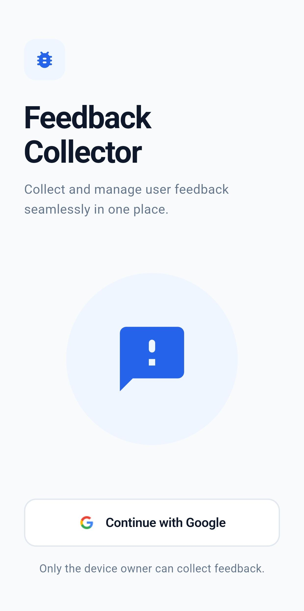
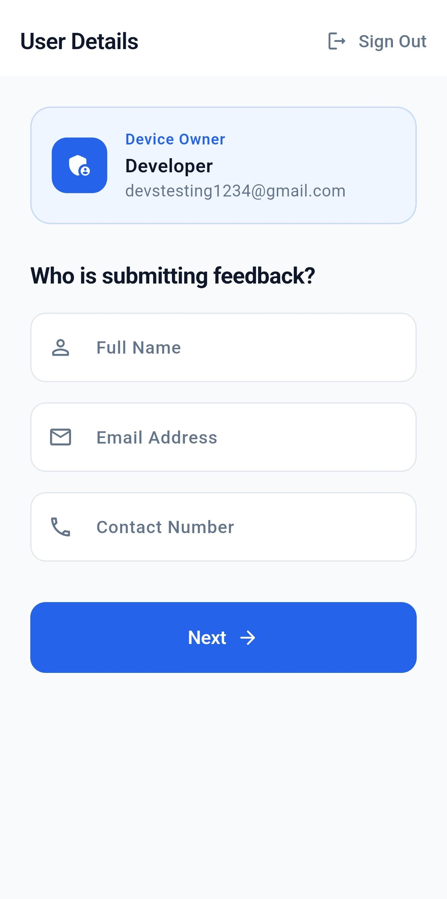
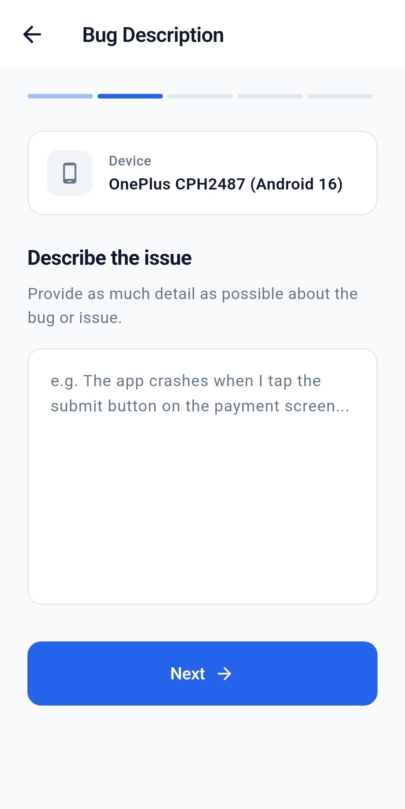
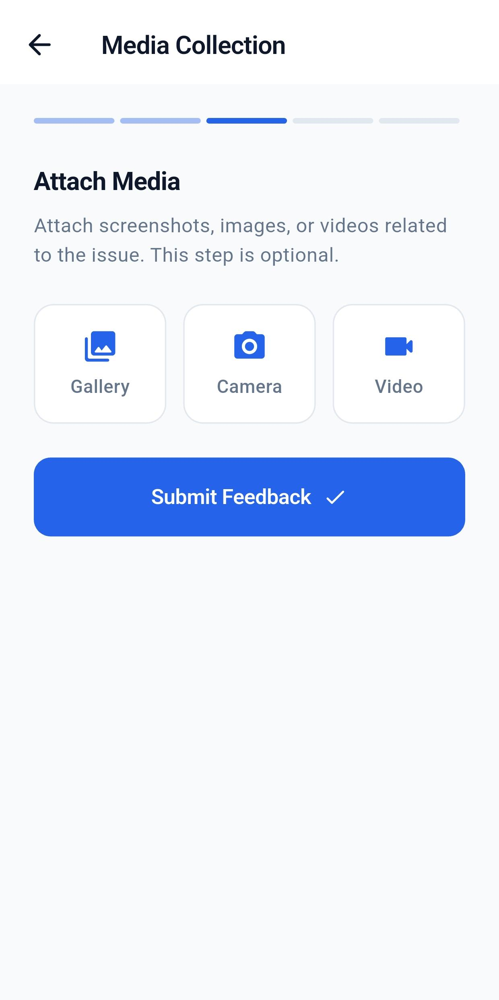
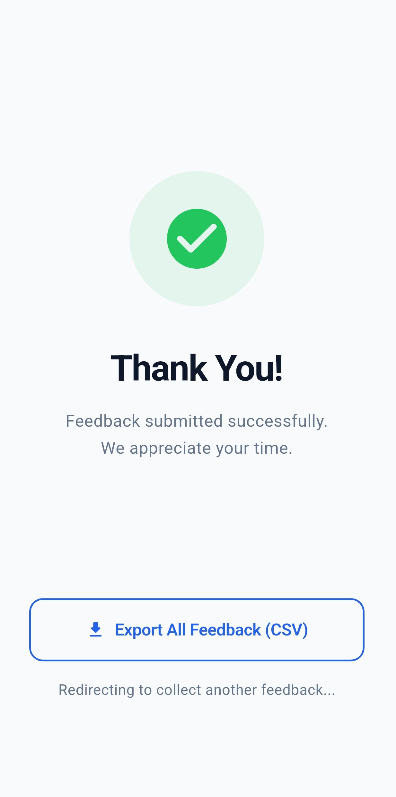

# Feedback Collector

A Flutter-based feedback management application that enables organizations to collect, manage, and export user feedback efficiently. The application provides a structured workflow for reporting issues, attaching media evidence, and storing feedback securely using Firebase.

---

## Overview

Feedback Collector streamlines the process of gathering user feedback by providing a guided, multi-step reporting experience. Users can authenticate with Google, submit detailed bug reports, attach screenshots or videos, and export collected feedback data in CSV format for further analysis.

---

## Features

### Authentication
- Google Sign-In using Firebase Authentication
- Restricted access for authorized users
- Secure session management

### Feedback Collection
- Multi-step feedback submission workflow
- User information collection
- Detailed bug and issue descriptions
- Device information capture

### Media Attachments
- Upload screenshots from gallery
- Capture images using device camera
- Record and attach videos
- Optional media submission

### Data Management
- Feedback storage using Firebase
- CSV export functionality
- Structured feedback records
- Easy data retrieval and analysis

### User Experience
- Clean and intuitive UI
- Progress tracking during submission
- Success confirmation screen
- Responsive design

---

## Application Flow

1. User authenticates using Google Sign-In.
2. User enters personal information.
3. User provides a detailed issue description.
4. User attaches screenshots, images, or videos (optional).
5. Feedback is submitted and stored.
6. Feedback data can be exported as a CSV file.

---

## Screenshots

### Login Screen


Secure Google authentication for authorized users.

---

### User Details Screen


Collects reporter information before feedback submission.

---

### Bug Description Screen


Allows users to provide detailed information about issues or bugs.

---

### Media Collection Screen


Supports image and video attachments for better issue reporting.

---

### Submission Success Screen


Confirms successful submission and provides CSV export functionality.

---

## Tech Stack

### Frontend
- Flutter
- Dart

### Backend & Services
- Firebase Authentication
- Cloud Firestore

### State Management
- flutter_bloc

### Dependency Injection
- get_it

### Local & File Handling
- image_picker
- file_picker
- csv

---

## Project Structure

```text
lib/
├── core/
│   ├── di/
│   └── theme/
│
├── data/
│   ├── models/
│   └── services/
│
├── presentation/
│   ├── blocs/
│   ├── screens/
│   └── login_screen.dart
│
└── main.dart
```

---

## Getting Started

### Prerequisites

- Flutter SDK
- Dart SDK
- Firebase Project
- Android Studio / VS Code

### Installation

```bash
git clone https://github.com/Harshit-0413/feedback-collector.git
cd feedback-collector

flutter pub get

flutter run
```

---

## Firebase Configuration

This project uses Firebase Authentication and Firestore.

To run the project:

1. Create your own Firebase project.
2. Enable Google Authentication.
3. Configure Firestore.
4. Add your Firebase configuration files:
   - google-services.json (Android)
   - GoogleService-Info.plist (iOS)
5. Run the application.

---

## Future Improvements

- Admin dashboard
- Feedback status tracking
- Push notifications
- Cloud Storage integration
- Analytics and reporting dashboard
- Role-based access control

---

